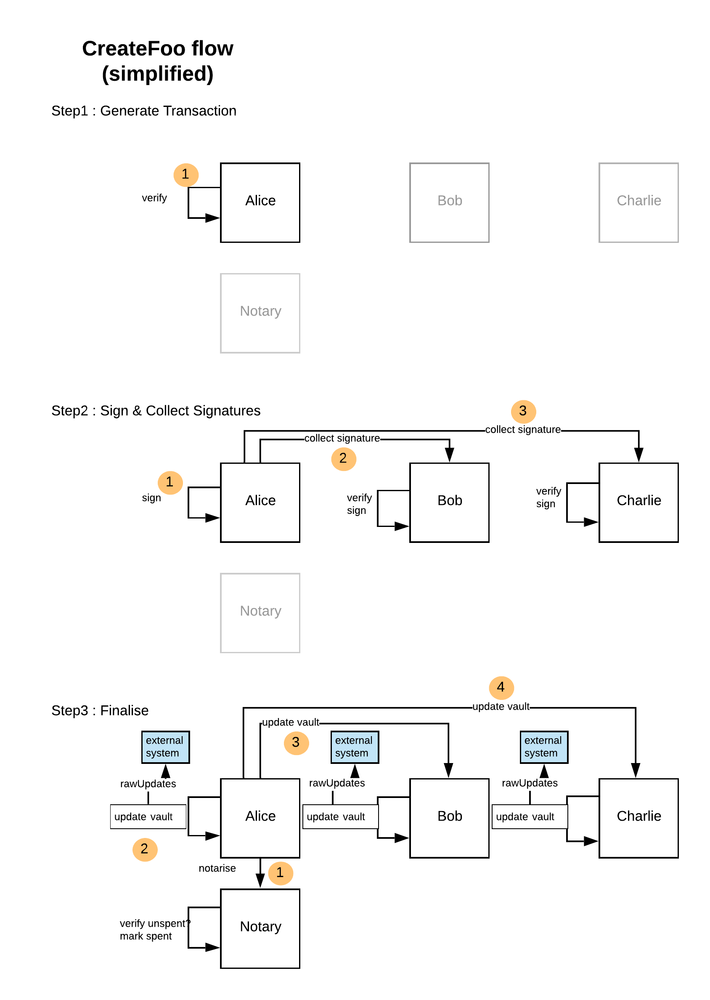

<p align="center">
  
</p>

# RawUpdates Demo CordApp 

This is a simple CordApp to demonstrate patterns for keeping an external database in sync with Corda using 
the [rawUpdates](https://docs.corda.net/api/javadoc/net/corda/core/node/services/VaultService.html#getRawUpdates--) API. 

## About rawUpdates

As the documentation for rawUpdates points out, use this API with great care. If the observer does 
unexpected things during the rawUpdate, then the ledger can be left in an inconsistent 
state.

In this example we make use of the new `HospitalizeFlowException` to let the external system signal to Corda
that the update failed, and this will push the flow into the hospital. So this pattern favours close integration, 
we accept that if the external system is unavailable it is better to fail the flow (and force it into the hospital), 
rather than have a second database that is out of sync. 

There are several important points to understand, as well as those documented with the API

1. The `rawUpdates` observer is triggered in the Finality flow **AFTER** the 
transaction has been notarised, so if in the event of an error the new states don't appear in the Corda ledger 
or the external database, they have still been notarised and cannot be used in another transaction. Corda will handle 
these situations via the `Flow Hospital`, but as noted in point 4 this is currently implemented on the assumption that 
problems writing to the database are very rare.     
2. In the current implementation of Corda there is no 2-phase style commit at this point. So if only `Charlie` 
fails, but `Alice` and `Bob` succeed, it is possible that `Alice` and `Bob` now see the new states, but `Charlie` doesn't. 
The exact behaviour will depend upon the internal implementation and may therefore change between Corda releases.
3. As the states have now been spent, the flow **has to get out of the hospital**. If not, there will be unusable 
states on the ledger. 
4. The current flow hospital has a poor bedside manner. It will only look at it's patients on node restart 
and only has one treatment plan. Future versions of Corda will have a better hospital.
5. The code in the rawUpdates handler must run quickly and be able to keep up with speed of writes to the Corda node, 
otherwise the node will start to buffer in the RxObservable layer, eventually exhausting buffer space and 
failing rawUpdates.
6. Thread pools may need to be increased simply to take account of the additional delay (in the external update)
before the tread is released back to pool. Likewise the database transaction window has been increased (the final commit 
is now delayed until the rawUpdate has completed), which may have implications on the performance of the database. For 
example connection pool sizes and the chance of deadlocks.
7. A Corda node running multiple concurrent transactions. i.e. multiple flow workers, has no central ordering across 
the all the chains being written to the database. The final data order is driven simply by the order in 
which threads actually write to the database. As rawUpdates will never trigger at exactly the same time window within 
this update, they will likely end up a slightly different order. Please note, the order within a single chain 
is ALWAYS correct and consistent, this concerns simply the order across chains.

Obviously there are now multiple possible failure and recovery modes that need to be understood and 
tested, for example:
* the initiating node fails intermittently 
* a participant node fails intermittently
* multiple nodes fail intermittently within the same flow
* a node fails continuously, i.e. goes back into the hospital 

This app lets us test these modes behave as expected, and also emulate 
the load of multiple clients, to test for possible race conditions. It is not 
an exhaustive set of scenarios, so please consider the more complicated flows and states that will 
exist in your real world application and add additional logic as necessary.

## The Finality Flow in more detail 

The diagram below summaries the key steps in a typical Corda flow. Some key points are

* once the initiating node has written to the Notary (step 1 in the Finalize stage) the transaction in on 
the ledger, it cannot be rolled back.
* once finalized, the initiating node now communicates to each of the other parties to commit it their 
vault as finalised, so there is always a window where some nodes see the latest update and others don't.
* If a node uses a spent state simply because it hasn't yet got the latest  update, then it will be detected by Corda, 
either by another participant that does have the correct state and therefore refuses to sign, or the Notary.  



*https://www.lucidchart.com/invitations/accept/bae1ecdc-0849-4c5d-871f-5a6774ddba46*

## Using this CordApp

There is one state, `FooState` and a simple flow, `CreateFoo` that issues new states to two parties, 
partyA and partyB, running the standard finality flow. By changing the action attribute in the FooState, different types of error 
condition in the `rawUpdates` observer can be emulated. 

Each node starts a simple service, `FooTrackerService` that runs the rawUpdates observer

Each node keeps track of what it has seen and done in a number of text files:

* **triggered.txt** - records every call to the observer 
* **foo-data.txt** - stores the update that would be stored in the external system, i.e. the successful updates 
* **foo-errors.txt** - stores the update that would have failed in the external system and have throw an exception
* **seen.txt** - internal state for the observer, just to stop it triggering exceptions repeatedly

The helper flows `FindFoo` and `FindFooAcrossNetwork` make it easier to check the state is 
as expected. 

Finally there is a simple command line app, which is normally the easiest way to run.  

## Pre-Requisites

See https://docs.corda.net/getting-set-up.html.

## Quick Start 

Build using gradle, if in a hurry just 

```bash
./gradlew build -x test
```

Deploy to running Corda nodes, e.g. Alice and Bob (note, will need Corda 4.4)

Edit the connection config `configs/connection.yaml` folder and run with 

```bash
$ java -jar clients/build/libs/clients-0.1.jar configs/example.yaml 
```

Details of what has been communicated to the node are in the `generated.txt` file. If successful, there will
be two entries for each flow and the 'Sent' message contains the flowid.

```bash 
$ cat generated-data.txt 
d9fee9cb-c987-49be-aceb-998d28e845e3,Sending
d9fee9cb-c987-49be-aceb-998d28e845e3,Sent,bb112660-23f1-4b6b-a2d4-8bc9eb0ed786,3894F9C7DFF2A6712BCC5EDF06376258AE5F2D7003C089D558B06CFD1D3B987F
83a0aa11-3c79-49be-a2ae-fde9c32a4255,Sending
83a0aa11-3c79-49be-a2ae-fde9c32a4255,Sent,648d08c8-d686-47a8-8d15-32ac2003f7bd,CD3098948ED067EE405D18C454C4C7368B7742DC878A144CD99D57B38AB7B147
``` 

This calls the `CreateFoo` flow, which simply issues a new FooState to both parties and runs 
the normal Finality Flow. On both nodes the `FooTrackerService`
is stated automatically and will record the data it has received via a rawUpdates observer to the 
csv file `foo-data.txt` in the nodes root folder. A simple example looks like:

```bash
$ cat foodata.txt 
4afc275d-39c9-4ef9-825e-2cd7459c7e8c,d9fee9cb-c987-49be-aceb-998d28e845e3,Thread 3 - Foo #2 from Alice to Bob,Alice,Bob,1579104980285
06d4fc65-9882-4e63-9a88-3df93a36b8c4,83a0aa11-3c79-49be-a2ae-fde9c32a4255,Thread 4 - Foo #1 from Alice to Bob,Alice,Bob,1579104980416
a4a84271-2d7b-4d2e-a9b5-663515de975b,0c80749e-a7e9-4a54-83fc-a8d33e6205ca,Thread 5 - Foo #1 from Alice to Bob,Alice,Bob,1579104980520
c92509cd-7b1c-4852-a567-e1938d8a0b23,155854b4-a97c-46b5-8d00-bd1f50826134,Thread 2 - Foo #3 from Alice to Bob,Alice,Bob,1579104980859
645657d9-7100-459d-84df-e3de8b6e526b,5c527a61-93e4-493c-b1ff-4367621435a6,Thread 1 - Foo #3 from Alice to Bob,Alice,Bob,1579104981268
```    

where:

* column1 - flowid
* column2 - linearid
* column3 - message
* columm4 - partyA
* columm5 - partyB
* column6 - unix timestamp 

Running the command line with a linearId will dump out details for that state across the both nodes.

```bash
$ java -jar clients/build/libs/clients-0.1.jar 0c80749e-a7e9-4a54-83fc-a8d33e6205ca
Reading config from 'configs/connection.yaml'
CordaRPC connection to localhost:10001
I 16:36:54 1 RPCClient.logElapsedTime - Startup took 995 msec
Data for node Alice:
In vault
  FooState(linearId=0c80749e-a7e9-4a54-83fc-a8d33e6205ca, data=Thread 5 - Foo #1 from Alice to Bob, partyA=O=Alice, L=New York, C=US, partyB=O=Bob, L=Paris, C=FR, action=Nothing)
rawUpdates
  FooState(linearId=0c80749e-a7e9-4a54-83fc-a8d33e6205ca, data=Thread 5 - Foo #1 from Alice to Bob, partyA=O=Alice, L=New York, C=US, partyB=O=Bob, L=Paris, C=FR, action=Nothing)

Data for node Bob:
In vault
  FooState(linearId=0c80749e-a7e9-4a54-83fc-a8d33e6205ca, data=Thread 5 - Foo #1 from Alice to Bob, partyA=O=Alice, L=New York, C=US, partyB=O=Bob, L=Paris, C=FR, action=Nothing)
rawUpdates
  FooState(linearId=0c80749e-a7e9-4a54-83fc-a8d33e6205ca, data=Thread 5 - Foo #1 from Alice to Bob, partyA=O=Alice, L=New York, C=US, partyB=O=Bob, L=Paris, C=FR, action=Nothing)
```
